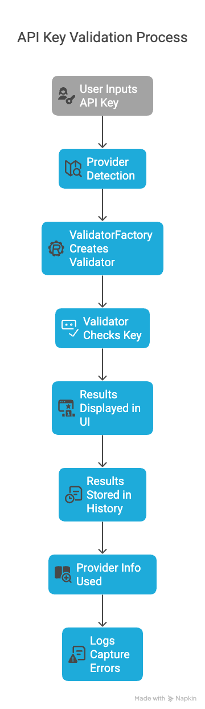
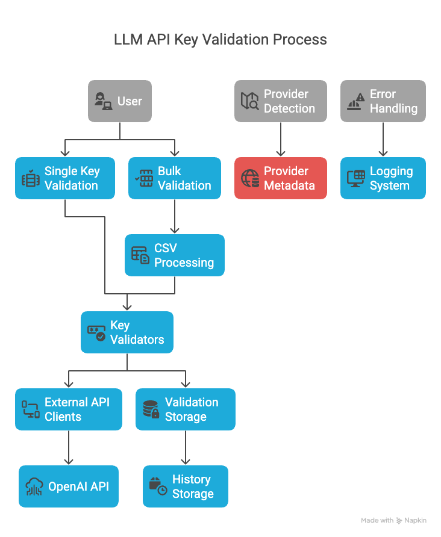

# LLM API Key Validator

A Streamlit application to validate API keys for various LLM providers and check their quota/usage information. This tool helps developers and teams manage their LLM API keys, check quotas, and understand available models across multiple providers.



## Features

- Validate API keys for 15+ LLM providers:
  - OpenAI (GPT models)
  - Anthropic (Claude models)
  - Mistral AI
  - Groq
  - Cohere
  - Google AI (Gemini)
  - OpenRouter
  - Together AI
  - Perplexity
  - Anyscale
  - Replicate
  - AI21 Labs
  - DeepSeek
  - ElevenLabs
  - xAI (Grok)
  - Azure OpenAI
  - AWS Bedrock
  - Custom providers via generic validation
- **Auto-detection** of API key providers based on key format
- Check if keys are valid
- Display available quota, usage, and limits (when available)
- Comprehensive account summaries with plan details and featured models
- Provider categorization (Free, Premium, Freemium, Credit-based)
- Information about free tiers, rate limits, and available models
- Bulk validation via CSV upload
- Validation history tracking
- Detailed logging of warnings and errors

## Installation

1. Clone this repository
2. Install the required packages:

```bash
pip install -r requirements.txt
```

## Usage

### Quick Start

The easiest way to run the app is using the provided runner scripts:

**On macOS/Linux:**

```bash
# Make the script executable
chmod +x run.sh

# Run with default settings
./run.sh

# Or specify custom port and virtual environment path
./run.sh --port 8502 --venv custom_venv
```

**On Windows:**

```batch
# Run with default settings
run.bat

# Or specify custom port and virtual environment path
run.bat --port 8502 --venv custom_venv
```

These scripts will:

1. Create a virtual environment if it doesn't exist
2. Install the required dependencies
3. Run the Streamlit app

### Manual Setup

If you prefer to set up manually:

```bash
# Create a virtual environment
python -m venv venv

# Activate the virtual environment
# On macOS/Linux:
source venv/bin/activate
# On Windows:
.venv\Scripts\activate

# Install dependencies
pip install -r requirements.txt

# Run the app
streamlit run main.py
```

### Single Key Validation

1. Select the LLM provider from the dropdown
2. Enter your API key
3. Click "Validate Key"
4. View the validation results and quota information

### Bulk Validation

1. Prepare a CSV file with columns: `provider,api_key`
2. Upload the CSV file
3. Click "Validate All Keys"
4. View the validation results for all keys

### Provider Information

The "Provider Info" tab offers detailed information about each LLM provider:

- Free Providers (No Credit Card Required)
- Premium Providers (Credit Card Required)
- Freemium Providers (Limited Free Tier)
- Credit-Based Providers (Free Credits)

For each provider, you'll find:

- Free tier details
- Available models
- Rate limits
- Token limits
- Signup links
- Pricing information

## Architecture

The application follows a modular layered architecture:



1. **UI Layer** (ui/)
   - Main Streamlit application (main_app.py)
   - Single Key Validation (single_key.py)
   - Bulk Validation (bulk_validation.py)
   - Validation History (history.py)
   - Provider Information (provider_info.py)

2. **Core Layer** (core/)
   - Base API Key classes (api_key.py)
   - Validator interface and factory (validator.py)

3. **Validators Layer** (validators/)
   - Provider-specific validators (openai.py, anthropic.py, etc.)
   - Each validator handles API calls and response parsing

4. **Utils Layer** (utils/)
   - Provider detection (detection.py)
   - Storage utilities (storage.py)
   - CSV processing (csv_utils.py)
   - Logging (logger.py)

5. **Data Layer** (data/)
   - Provider information (provider_info.json)
   - Validation history (history.json)

6. **External Systems**
   - Various LLM Provider APIs

### Modular Structure


### Data Flow

1. User inputs API key through the UI (ui/single_key.py or ui/bulk_validation.py)
2. Provider detection (utils/detection.py) identifies the provider
3. ValidatorFactory creates appropriate validator (core/validator.py)
4. Validator checks key against provider API (validators/[provider].py)
5. Results are displayed in UI and stored in history (utils/storage.py)
6. Provider info (data/provider_info.json) is used for display and categorization
7. Logs capture errors and warnings for debugging (utils/logger.py)

## Project Structure

The project follows a modular architecture:

- `main.py`: Main entry point for the Streamlit application
- `core/`: Core components and interfaces
  - `api_key.py`: Base APIKey class and provider-specific subclasses
  - `validator.py`: Base Validator interface and factory
- `validators/`: Provider-specific validators
  - `openai.py`: OpenAI validator
  - `anthropic.py`: Anthropic validator
  - `mistral.py`: Mistral validator
  - `groq.py`: Groq validator
  - `cohere.py`: Cohere validator
  - `google.py`: Google validator
  - `openrouter.py`: OpenRouter validator
  - (and more provider-specific validators)
- `ui/`: User interface components
  - `main_app.py`: Main Streamlit application class
  - `single_key.py`: Single key validation page
  - `bulk_validation.py`: Bulk validation page
  - `history.py`: Validation history page
  - `provider_info.py`: Provider information page
- `utils/`: Utility modules
  - `detection.py`: Provider detection utilities
  - `storage.py`: Storage utilities for saving validation history
  - `csv_utils.py`: Utilities for handling CSV uploads and downloads
  - `logger.py`: Logging utilities for warnings and errors
- `data/`: Data files
  - `provider_info.json`: Provider information and metadata
  - `history.json`: Validation history
- `run.py`, `run.sh`, `run.bat`: Scripts for running the app with virtual environment support
- `logs/`: Directory for log files
- `docs/`: Documentation and screenshots

## Documentation

- **Architecture**: See the [Architecture Diagram](#architecture) and [Data Flow](#data-flow) sections above
- **Providers**: [Categories](docs/provider_categories.md), [Information Structure](docs/provider_info_structure.md), [Key Detection](docs/api_key_detection.md)
- **Development**: [Adding Providers](docs/adding_new_provider.md), [Validator Implementation](docs/validator_implementation.md)

## Security Notes

- API keys are never stored in plain text
- Only hashed references to keys are saved in the validation history
- All validation is done locally, keys are not sent to any third-party services
- No data is sent to external servers except for the validation requests to the provider APIs

## Contributing

Contributions are welcome! Please feel free to submit a Pull Request.

1. Fork the repository
2. Create your feature branch (`git checkout -b feature/amazing-feature`)
3. Commit your changes (`git commit -m 'Add some amazing feature'`)
4. Push to the branch (`git push origin feature/amazing-feature`)
5. Open a Pull Request

## License

MIT
