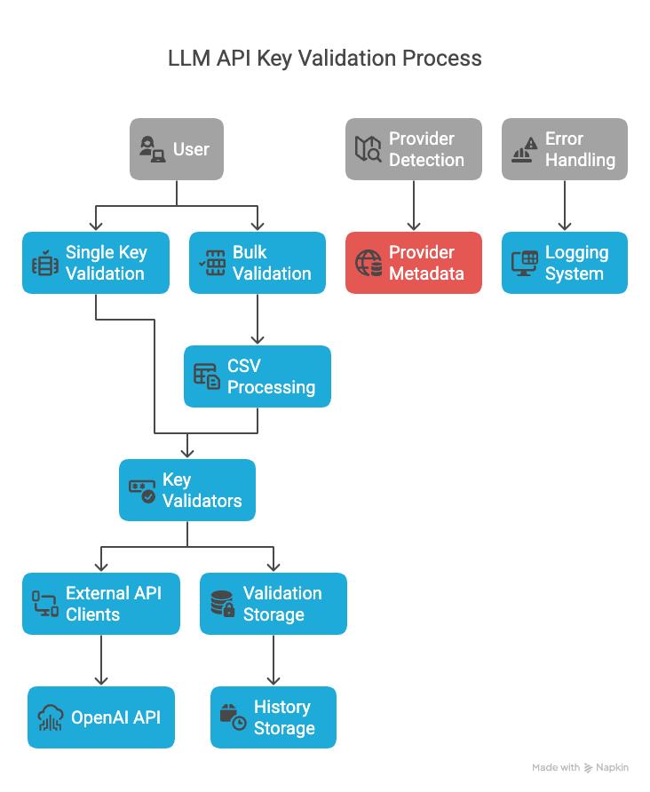

# LLM API Key Validator - Architecture Diagram

The LLM API Key Validator follows a layered architecture that separates concerns and makes the codebase more maintainable.

## System Architecture

The architecture consists of the following layers:

1. **UI Layer** (ui/)
   - Main Streamlit application (main_app.py)
   - Single Key Validation (single_key.py)
   - Bulk Validation (bulk_validation.py)
   - Validation History (history.py)
   - Provider Information (provider_info.py)

2. **Core Layer** (core/)
   - Base API Key classes (api_key.py)
   - Validator interface and factory (validator.py)

3. **Validators Layer** (validators/)
   - Provider-specific validators (openai.py, anthropic.py, etc.)
   - Each validator handles API calls and response parsing

4. **Utils Layer** (utils/)
   - Provider detection (detection.py)
   - Storage utilities (storage.py)
   - CSV processing (csv_utils.py)
   - Logging (logger.py)

5. **Data Layer** (data/)
   - Provider information (provider_info.json)
   - Validation history (history.json)

6. **External Systems**
   - Various LLM Provider APIs

## Component Responsibilities

- **UI Layer (ui/)**: Handles all user interactions and display
  - main_app.py: Main Streamlit application
  - single_key.py: Single key validation page
  - bulk_validation.py: Bulk validation page
  - history.py: Validation history page
  - provider_info.py: Provider information page

- **Core Layer (core/)**:
  - api_key.py: Base APIKey class and provider-specific subclasses
  - validator.py: Base Validator interface and factory

- **Validators Layer (validators/)**:
  - Provider-specific validators implementing the Validator interface
  - Each validator handles API calls and response parsing for a specific provider

- **Utils Layer (utils/)**:
  - detection.py: Provider detection utilities
  - storage.py: Manages validation history
  - csv_utils.py: Handles CSV operations for bulk validation
  - logger.py: Captures errors, warnings, and debug information

- **Data Layer (data/)**:
  - provider_info.json: Metadata about providers, free tiers, etc.
  - history.json: Validation history
