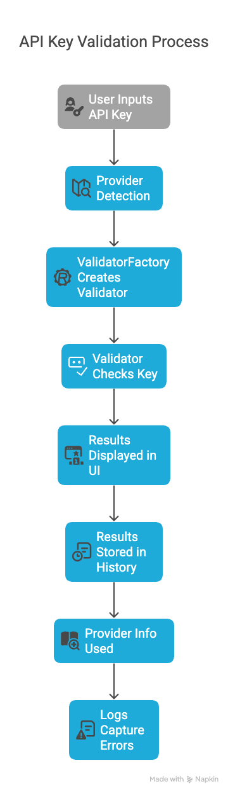

# LLM API Key Validator - Data Flow Diagram

The LLM API Key Validator follows a structured data flow that ensures efficient validation of API keys and presentation of results.

## API Validation Process

## Detailed Data Flow

1. **Single Key Validation Flow**:
   - User → ui/single_key.py → utils/detection.py → core/validator.py →
   - validators/[provider].py → External API → Response → utils/storage.py →
   - UI Display

2. **Bulk Validation Flow**:
   - CSV Upload → ui/bulk_validation.py → utils/csv_utils.py →
   - utils/detection.py → core/validator.py → validators/[provider].py →
   - External APIs → Results Collection → utils/storage.py → UI Display

3. **Provider Detection Flow**:
   - API Key → utils/detection.py → core/api_key.py →
   - core/validator.py (ValidatorFactory) → validators/[provider].py

4. **History Storage Flow**:
   - Validation Results → utils/storage.py → data/history.json →
   - ui/history.py → UI Display

5. **Provider Info Flow**:
   - data/provider_info.json → utils/storage.py (ProviderInfo) →
   - ui/provider_info.py → UI Display

6. **Error Handling Flow**:
   - Exceptions → utils/logger.py → logs/ → UI Error Display
